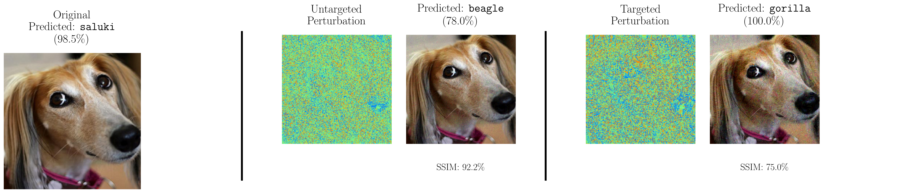
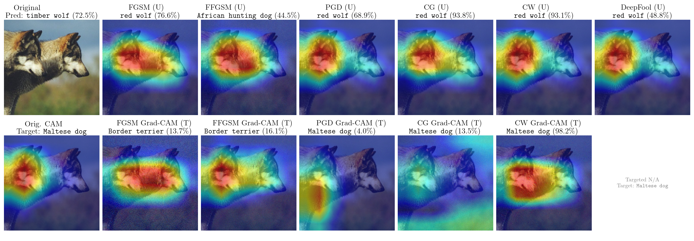

# Adversarial Attacks on Neural Networks: A Survey

This repository contains implementations of various optimization methods for generating adversarial examples against convolutional neural networks. It accompanies the research paper "Adversarial Attacks on Neural Networks: A Survey."

## Overview

Adversarial examples are carefully crafted perturbations that, when added to an input image, cause neural networks to misclassify the image while appearing visually imperceptible to humans. This project and the accompanying paper provide a systematic survey and empirical comparison of six foundational adversarial attack strategies:

1. Fast Gradient Sign Method (FGSM)
2. Fast FGSM (FFGSM)
3. DeepFool
4. Carlini & Wagner (C\&W)
5. Projected Gradient Descent (PGD)
6. Conjugate Gradient (CG)

## Recommended Attack Methods

Based on the findings in our survey, the following attack methods are highlighted:

1. **C\&W (Carlini & Wagner)**: Consistently achieves high success rates with minimal perturbations, particularly for targeted attacks, but incurs high computational overhead.
   ```bash
   # Example for a strong targeted L2 attack (parameters from paper/tests):
   python demo.py --method cw --norm L2 --targeted --target-method least-likely --c-val 10 --confidence 5 --steps 500 --learning-rate 0.01
   # Example for a default untargeted L2 attack:
   # python demo.py --method cw --norm L2 --c-val 1 --confidence 0 --steps 1000 --learning-rate 0.01
   ```

2. **PGD (Projected Gradient Descent)**: Offers a strong balance between attack effectiveness and computational cost. Effective for both untargeted and targeted attacks under various L_p norms.
   ```bash
   # Example for Linf Untargeted (epsilon=8/255, 40 steps, step_size=eps/4):
   python demo.py --method pgd --norm Linf --epsilon 0.03137 --steps 40 --step-size 0.00784
   # Example for Linf Targeted (epsilon=16/255, 200 steps, step_size=eps/10):
   # python demo.py --method pgd --norm Linf --targeted --target-method least-likely --epsilon 0.06274 --steps 200 --step-size 0.00627
   ```

3. **DeepFool**: Particularly effective for generating untargeted attacks with very small L2 perturbations, though computationally more intensive than FGSM or PGD. (DeepFool is generally untargeted).
   ```bash
   # Example (L2 norm is implicit for DeepFool):
   python demo.py --method deepfool --steps 50 --overshoot 0.02
   ```

4. **CG (Conjugate Gradient)**: Can be more efficient than PGD on certain complex loss landscapes by utilizing approximate second-order information, offering a balance between cost and potency.
   ```bash
   # Example for Linf Untargeted (epsilon=8/255, 40 steps):
   python demo.py --method cg --norm Linf --epsilon 0.03137 --steps 40 --alpha 0.00784 # alpha similar to PGD step_size
   # Example for Linf Targeted (epsilon=16/255, 60 steps from paper):
   # python demo.py --method cg --norm Linf --targeted --target-method least-likely --epsilon 0.06274 --steps 60 --alpha 0.00627
   ```

5. **FGSM/FFGSM**: The fastest methods, suitable for scenarios requiring rapid generation (e.g., adversarial training). Less effective for targeted attacks and against robust models. FFGSM adds a small random initialization to potentially improve FGSM.
   ```bash
   # Example FGSM (Untargeted, Linf, epsilon=4/255):
   python demo.py --method fgsm --norm Linf --epsilon 0.01568
   # Example FFGSM (Untargeted, Linf, epsilon=8/255, alpha=0.1*epsilon):
   python demo.py --method ffgsm --norm Linf --epsilon 0.03137 --alpha 0.00313
   # Example FFGSM (Targeted, Linf, epsilon=32/255, alpha=0.02 from paper):
   # python demo.py --method ffgsm --norm Linf --targeted --target-method least-likely --epsilon 0.12549 --alpha 0.02
   ```

## Repository Structure

```
adversarial-attacks/
├── data/                   # Directory for dataset storage
├── results/                # Experimental results
├── src/                    # Source code
│   ├── attacks/            # Attack implementations
│   │   ├── base.py         # Base attack class
│   │   ├── fgsm.py         # Fast Gradient Sign Method
│   │   ├── ffgsm.py        # Fast FGSM
│   │   ├── deepfool.py     # DeepFool
│   │   ├── cw.py           # Carlini & Wagner
│   │   ├── pgd.py          # Projected Gradient Descent
│   │   └── cg.py           # Conjugate Graident Method
│   ├── models/             # Model wrappers
│   ├── plot/               # Visualization tools
│   └── utils/              # Utility functions
│       ├── data.py         # Data loading utilities
│       ├── evaluation.py   # Evaluation metrics
│       ├── metrics.py      # Performance metrics
│       └── projections.py  # Projection operations
├── requirements.txt        # Dependencies
└── README.md               # This file
```

## Installation

```bash
# Clone the repository
git clone https://github.com/ali-izhar/adversarial-attacks.git
cd adversarial-attacks

# Create a virtual environment (optional but recommended)
python -m venv venv
source venv/bin/activate  # On Windows: venv\Scripts\activate

# Install dependencies
pip install -r requirements.txt
```

## Usage

### Running Experiments

```bash
# Compare optimization methods
python experiments/compare_optimizers.py
```

### Implementing Your Own Attacks

You can extend the base attack class to implement your own optimization methods:

```python
from src.attacks.base import BaseAttack

class MyAttack(BaseAttack):
    def __init__(self, model, **kwargs):
        super().__init__(model, **kwargs)
        
    def generate(self, images, labels):
        # Implement your attack here
        pass
```

## Evaluation Metrics

We evaluate each optimization method using criteria discussed in the paper:

- **Attack Effectiveness**: Percentage of inputs successfully misclassified (Success Rate).
- **Perturbation Efficiency**: Measured by $L_2$ norm, $L_\infty$ norm, and Structural Similarity Index (SSIM).
- **Computational Efficiency**: Assessed via average iterations to convergence, total gradient computations, and wall-clock runtime per successful attack.

## Visualizations from the Paper

Below are some example visualizations from the paper, illustrating the effects of different adversarial attacks.

**Figure 1: Untargeted vs. Targeted Attack Example (from paper Figure 1)**
*(Illustrates untargeted vs. targeted adversarial attack outcomes on ResNet-18. Original image correctly classified as "saluki". Untargeted attack results in "beagle". Targeted attack forces classification to "gorilla".)*



**Figure 2: Qualitative Comparison of Untargeted Attacks (from paper Figure 2)**
*(Qualitative comparison of untargeted attacks on ResNet-18 generated by different methods for several input images. Original images are correctly classified. All attack methods induce misclassification to various incorrect labels.)*


**Figure 3: Grad-CAM Visualization of Model Attention (from paper Figure 6.1 / Figure 3 in PDF text)**
*(Comparison of adversarial attacks and their effect on model attention using Grad-CAM. Illustrates how iterative methods successfully redirect model's attention for targeted attacks, while single-iteration methods struggle.)*



## Citation

If you use this code or refer to the findings in your research, please cite our paper:

```
@article{ali2023survey,
  title={Adversarial Attacks on Neural Networks: A Survey},
  author={Ali, Izhar},
  journal={arXiv preprint arXiv:XXXX.XXXXX},  # Update with actual arXiv ID once available
  year={2023} # Or the actual year of publication/submission
}
```

## License

This project is licensed under the MIT License - see the LICENSE file for details.